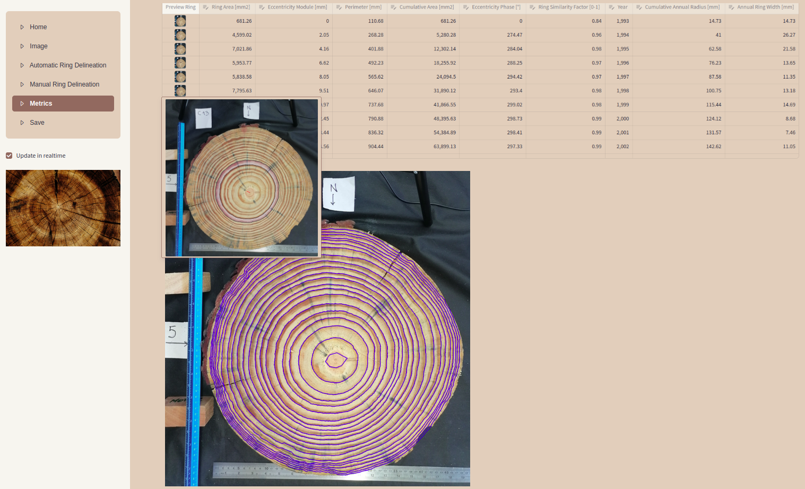

# Tras: An Interactive Software for tracing Tree Ring Cross-Sections.


Tras is a Python-based interactive software designed for tracing and analyzing tree ring cross-sections. It provides tools for automatic and manual ring delineation, as well as metrics computation. The application leverages Streamlit for the user interface, making it easy to visualize and interact with the data.
Features

**Automatic Ring Delineation**: Automatically detect and trace tree rings.

**Manual Ring Delineation**: Manually adjust and refine ring boundaries.

**Metrics Computation**: Calculate various metrics based on the traced rings.

**Interactive Visualization**: Use Streamlit to visualize and interact with the data.


## Installation
### On Linux
Follow the instructions below to set up the environment ([anaconda](https://anaconda.com))and install the necessary dependencies:
```bash
git clone https://github.com/hmarichal93/tras.git && cd tras
conda env create -f environment.yml
conda activate tras
./install.sh $CONDA_PREFIX_1
```
Replace `$CONDA_PREFIX_1` with the path to the conda environment where
the application is installed. 
The `install.sh` script will download the necessary data files and set up the application for use. It will create an icon on the desktop for easy access to the application called `DendroTool`.
### On Windows
Download [virtual box](https://www.virtualbox.org/wiki/Downloads) windows 
host and install it. 
Then download a linux image (in VDI format) from [osboxes](https://www.osboxes.org/ubuntu/) and [install](https://www.makeuseof.com/how-to-import-vdi-file-into-virtualbox/) it on virtual box. 
We tested with [Linux Lite 5.8](https://www.osboxes.org/linux-lite/#linux-lite-5-8-vbox), 
with 6 GB and 2 cores. After that, run the instruction from the Linux section.

#### Linux Lite 5.8
```bash
#1
sudo apt install git -y
```
## Usage
Run the application using the following command:
```bash
streamlit run app.py
```
Additionally you can run the application using the icon created on the desktop.


