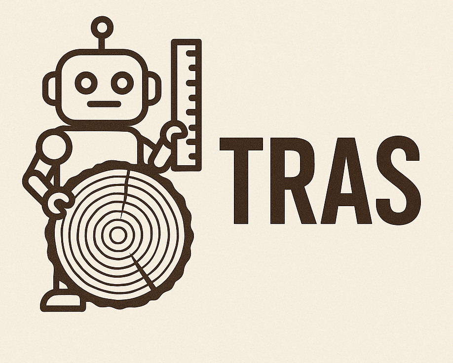
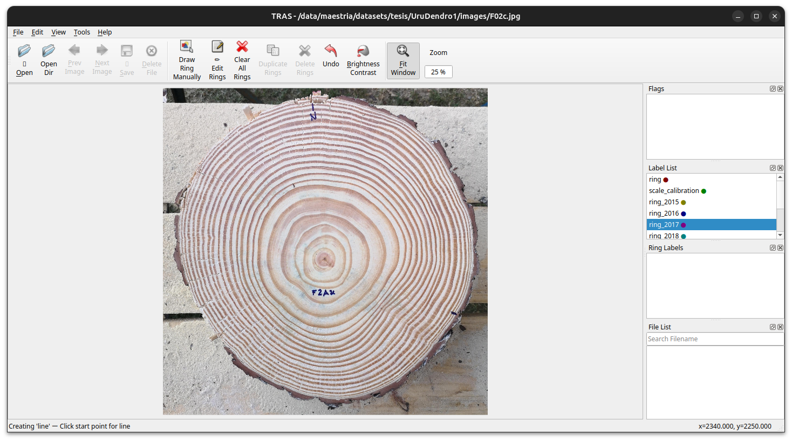
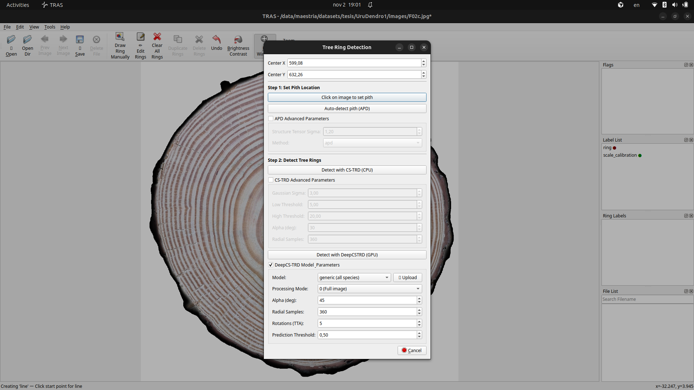
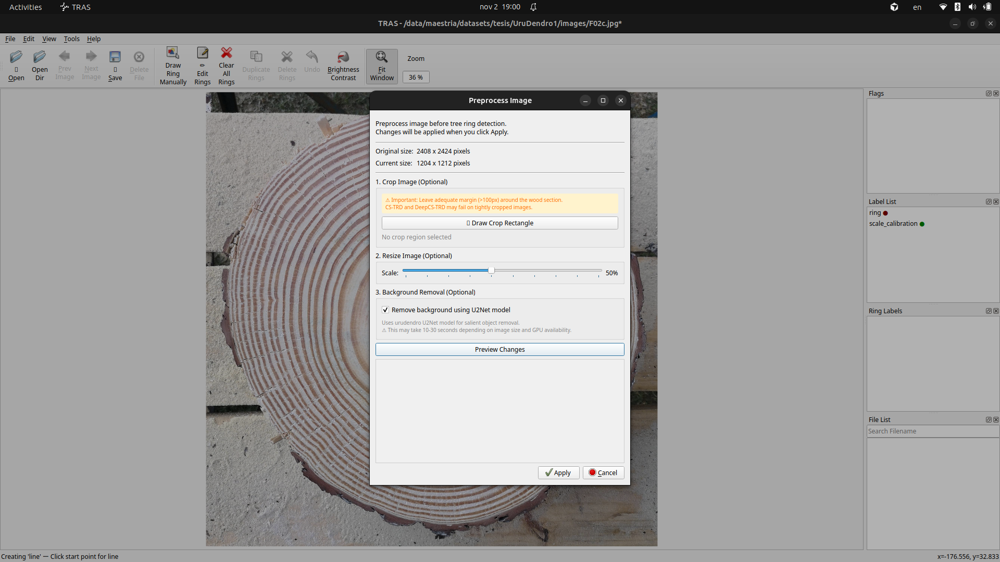
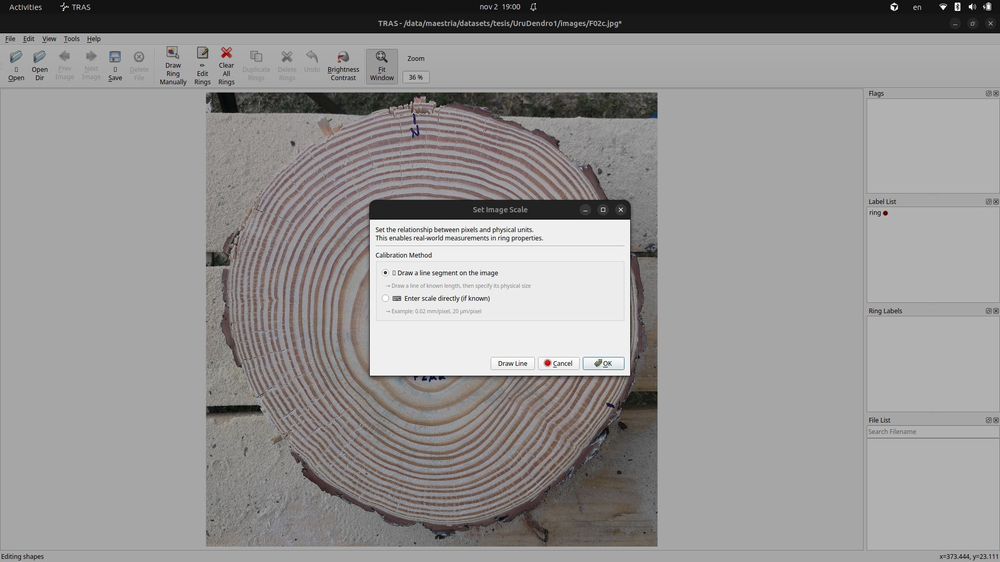
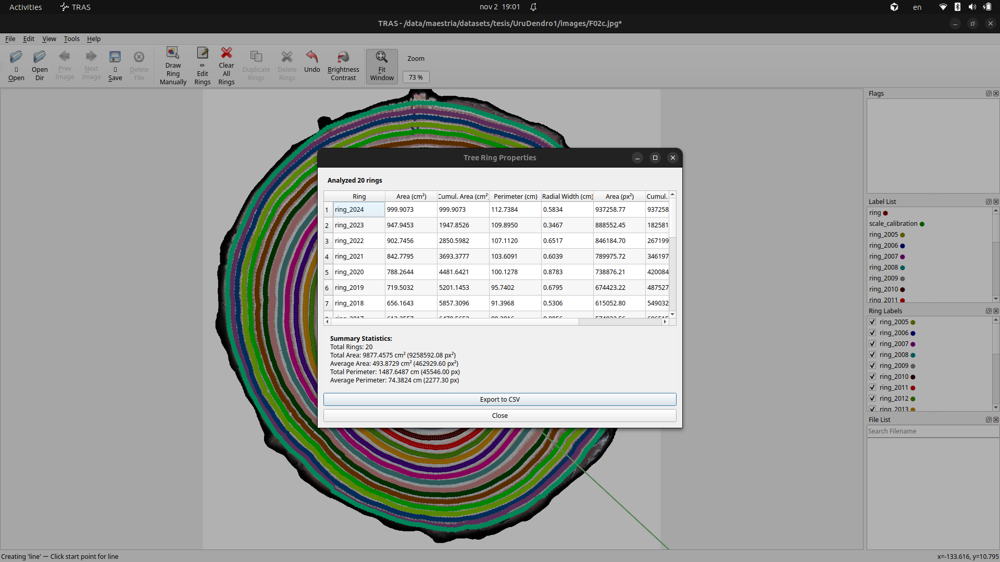
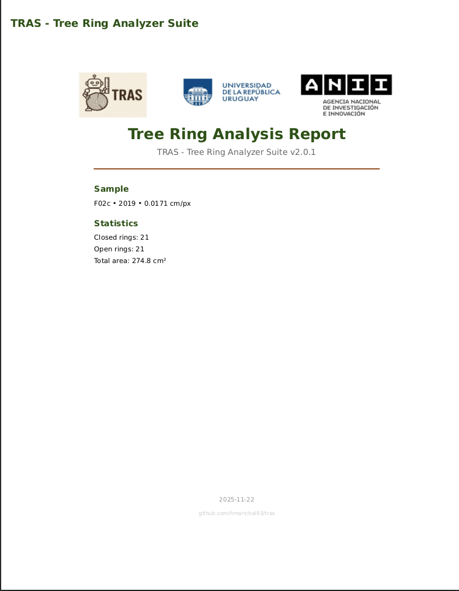
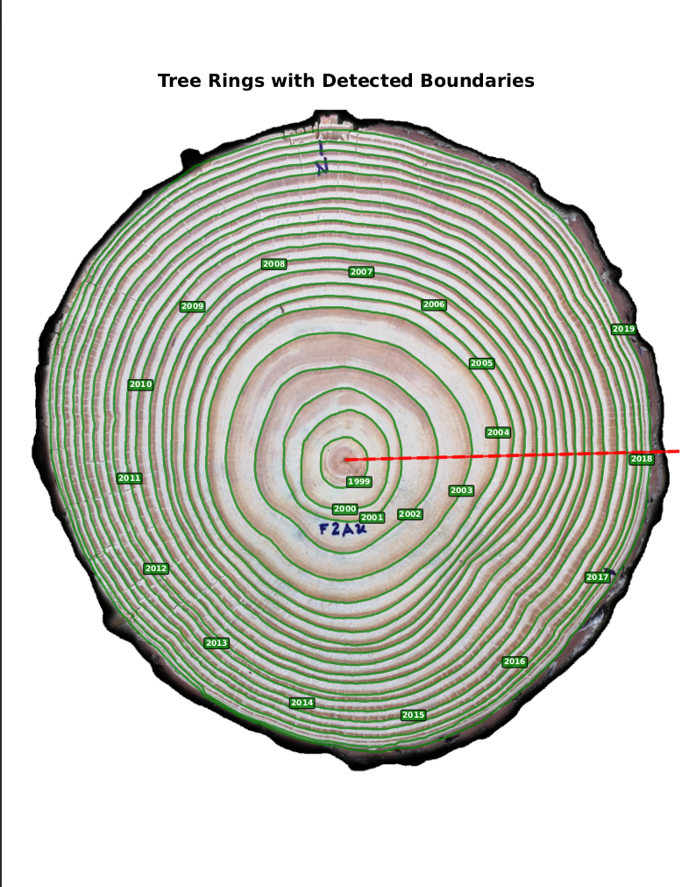
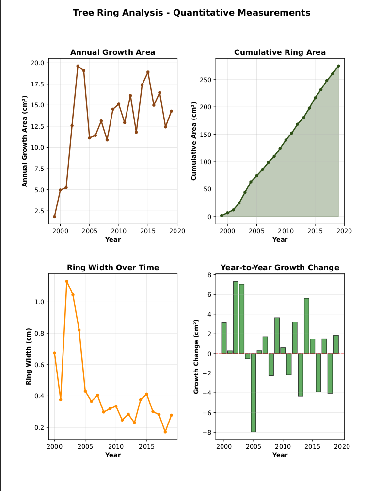

<div align="center">

# 🌲 TRAS — Tree Ring Analyzer Suite

<p align="center">
  
</p>

**Professional dendrochronology software for automatic tree ring detection and measurement**

*Accepted as a Software Article at Forestry: An International Journal of Forest Research*

[](https://github.com/hmarichal93/tras/releases/latest)
[](https://github.com/hmarichal93/tras/releases)
[](https://www.gnu.org/licenses/gpl-3.0)
[](https://www.python.org)
[](https://arxiv.org/abs/2605.08025)

[Overview](#-overview) • [Features](#-key-features) • [Installation](#-installation) • [Quick Start](#-quick-start) • [Workflow](#-workflow) • [Citations](#-citations)

</div>

---

## 🎯 Overview

TRAS integrates **state-of-the-art computer vision** and **deep learning** methods for dendrochronology research. Automatically detect tree rings, measure ring widths, and export data in standard formats — all through an intuitive graphical interface, a programmatic Python API, or a command-line tool for batch jobs.

<p align="center">
  
</p>

**Three ways to use TRAS:**

| Interface | Command | Best for |
|-----------|---------|----------|
| 🖥️ **GUI** | `tras` | Interactive annotation, single samples, batch folders |
| ⌨️ **CLI** | `tras_detect` | Scripting, reproducible batch pipelines |
| 🐍 **Python API** | `from tras.api import detect` | Custom workflows and integration |

---

## ✨ Key Features

<table>
<tr>
<td width="50%" valign="top">

### 🔬 Automatic Detection
- **APD** — Automatic Pith Detection (~1 s, CPU); methods `apd`, `apd_pcl`, `apd_dl` (YOLO)
- **CS-TRD** — Classical edge detection (~73 s, CPU) *[Linux/macOS only]*
- **DeepCS-TRD** — Deep learning U-Net (~101 s, GPU)
- **INBD** — Iterative Next Boundary Detection (CVPR 2023, GPU)



</td>
<td width="50%" valign="top">

### 🖼️ Preprocessing
- Smart crop with edge warnings
- Resize (10–100 % scaling)
- U2Net background removal
- Full parameter tracking



</td>
</tr>
<tr>
<td width="50%" valign="top">

### 📏 Scale Calibration
- Draw a known-length segment
- Direct μm/cm/mm input
- Auto-adjust on resize
- Physical-unit exports



</td>
<td width="50%" valign="top">

### 📊 Analysis & Export
- Ring properties (area, perimeter)
- Radial width measurements
- Year-based labeling
- JSON, CSV & .POS formats



</td>
</tr>
</table>

### 📄 Professional PDF Reports

Generate comprehensive reports with a single click:

- Sample metadata and summary statistics
- Ring overlay with detected boundaries
- Multi-panel analysis plots (area, growth rate, radial width)
- Ready for publication or archival

<p align="center">
<table>
<tr>
<td width="33%" align="center">

<br/><b>Cover Page</b>
</td>
<td width="33%" align="center">

<br/><b>Ring Overlay</b>
</td>
<td width="33%" align="center">

<br/><b>Analysis Plots</b>
</td>
</tr>
</table>
</p>

---

## 📦 Installation

> **Windows users:** run every command below from the **Anaconda Prompt** (search "Anaconda Prompt" in the Start menu), **not** the regular Command Prompt. CS-TRD is unavailable on Windows — use DeepCS-TRD instead.

### Prerequisites

- [Anaconda / Miniconda](https://www.anaconda.com/download) — [Windows video tutorial](https://youtu.be/4DQGBQMvwZo)
- Python ≥ 3.9 (provided by the conda environment)

### 1. Download TRAS

**Linux / macOS:**
```bash
export TRAS_VERSION=2.1.9          # update when a newer release is available
wget https://github.com/hmarichal93/tras/archive/refs/tags/v${TRAS_VERSION}.tar.gz
tar -xzf v${TRAS_VERSION}.tar.gz
cd tras-${TRAS_VERSION}
```

> **Alternative:** download manually from [Releases](https://github.com/hmarichal93/tras/releases/latest) and extract, then `cd` into the extracted folder.

### 2. Create the Environment

```bash
conda env create -f environment.yml
conda activate tras
pip install -e .
```

### 3. Download Model Weights

```bash
python tools/download_release_assets.py
```

> Fetches all required model weights, including the APD YOLO weights (`downloaded_assets/apd/yolo/all_best_yolov8.pt`) used by the `apd_dl` method.

### 4. Compile the Devernay Edge Detector *(CS-TRD — Linux/macOS only, optional)*

```bash
cd tras/tree_ring_methods/cstrd/devernay
make
cd ../../../..                      # back to the project root
```

### 5. Install the INBD Method *(optional)*

```bash
mkdir -p tras/tree_ring_methods/inbd && cd tras/tree_ring_methods/inbd
git clone https://github.com/hmarichal93/INBD.git src
./download_models.sh
cd ../../..                         # back to the project root
```

---

## 🚀 Quick Start

### 🖥️ GUI

```bash
tras                               # launch the GUI
tras /path/to/image.jpg            # launch with an image open
tras --version                     # print the version
```

The **Tools** menu has two groups:

- **Single** — the step-by-step workflow for the currently open image (set scale → preprocess → detect → measure → export).
- **Batch Processing…** — run detection over an entire folder (see below).

### 📁 GUI Batch Processing

**`Tools → Batch Processing…`** opens a dialog where you pick an input folder and configure the
detection settings inline — optional physical scale, preprocessing, pith method, and ring method
with its parameters. Detection runs in the background with a live progress bar.

For every image, TRAS writes a `.json` label file. When the batch finishes it also produces:

| Output | Description |
|--------|-------------|
| `summary.pdf` | One page per image — detected rings overlaid on the image, with the filename as the page title |
| `batch_config.yml` | The exact settings used, re-loadable by the CLI (`tras_detect --config`) |

> 💡 All outputs are written **into the input folder itself**, alongside the images. Images that
> already have a `.json` are skipped, so an interrupted batch resumes simply by running it again.

### ⌨️ CLI

`tras_detect` automatically detects whether the input is a single image or a folder.

**Single image:**
```bash
# Auto-detect pith and rings
tras_detect image.jpg -o output.json

# With custom parameters
tras_detect image.jpg --ring-method deepcstrd --pith-method apd_dl
```

**Batch folder:**
```bash
# With a YAML config file (recommended)
tras_detect /path/to/images --config config.yml

# With CLI flags only
tras_detect /path/to/images --scale-value 0.0213 --scale-unit mm --ring-method deepcstrd

# Config file overridden by CLI flags
tras_detect /path/to/images --config config.yml --scale-value 0.025 --ring-method cstrd
```

**Outputs:**
- **Single image** → `<stem>_detected.json` (or your custom `-o` path)
- **Batch folder** → `tras_out/<stem>.json`, `<stem>.csv`, and `<stem>.pdf` per image

> **Required for CLI batch processing:** a physical scale must be provided, either via the config
> file or via `--scale-value` and `--scale-unit`.

See [`examples/cli/process_config.yml`](examples/cli/process_config.yml) for a complete configuration template.

---

## 📖 Workflow

<details>
<summary><b>📋 Step-by-step guide (single image)</b></summary>

<br/>

> These per-image tools live under the **`Tools → Single`** submenu. To process a whole folder at
> once, use **`Tools → Batch Processing…`** instead (see [GUI Batch Processing](#-gui-batch-processing)).

1. **📁 Load Image** — `File → Open` or drag-and-drop a wood cross-section image
2. **📏 Set Scale** *(optional)* — `Tools → Single → Set Image Scale`; draw a known-length line or enter it directly
3. **🖼️ Preprocess** *(optional)* — `Tools → Single → Preprocess Image`; crop, resize, or remove background
4. **🎯 Detect Rings** — `Tools → Single → Tree Ring Detection`
   - Pith: APD auto (`apd`, `apd_pcl`, `apd_dl`) or manual click
   - Method: CS-TRD (Linux/macOS), DeepCS-TRD, or INBD
5. **📝 Add Metadata** — `Tools → Single → Sample Metadata`; harvested year, sample code, notes
6. **📐 Measure Width** *(optional)* — `Tools → Single → Measure Ring Width`; define a radial transect
7. **📊 View Properties** — `Tools → Single → Ring Properties`; review measurements
8. **💾 Export** — JSON, CSV (all data), or .POS (CooRecorder format)

</details>

---

## 🧠 Training Custom Models

TRAS supports loading user-trained models for **INBD** and **DeepCS-TRD** to improve detection on
your specific datasets. See the **[Training Custom Models guide](docs/training_custom_models.md)**
for step-by-step instructions.

---

## ⚙️ Configuration

TRAS stores its configuration in `~/.trasrc`. You can customize:

- Default shape colors (wood theme)
- Keyboard shortcuts
- Detection method defaults
- UI preferences

---

## 📋 Requirements

- Python ≥ 3.9
- PyQt5
- OpenCV
- PyTorch (for DeepCS-TRD)
- Shapely 1.7.0

See [`pyproject.toml`](pyproject.toml) for the complete dependency list.

---

## 📚 Citations

If you use TRAS in your research, please cite the relevant papers below.

<details>
<summary><b>📖 BibTeX entries</b></summary>

<br/>

**UruDendro**
```bibtex
@article{UruDendro,
  author    = {Henry Marichal and Diego Passarella and Christine Lucas and Ludmila Profumo and Verónica Casaravilla and María Noel Rocha Galli and Serrana Ambite and Gregory Randall},
  title     = {UruDendro, a public dataset of 64 cross-section images and manual annual ring delineations of \textit{Pinus taeda L.}},
  journal   = {Annals of Forest Science},
  volume    = {82},
  number    = {1},
  pages     = {25},
  year      = {2025},
  issn      = {1297-966X},
  doi       = {10.1186/s13595-025-01296-5},
  url       = {https://doi.org/10.1186/s13595-025-01296-5}
}
```

**APD — Automatic Pith Detection**
```bibtex
@inproceedings{apd,
  isbn = {978-3-031-78447-7},
  year = {2025},
  pages = {1--15},
  title = {Automatic Wood Pith Detector: Local Orientation Estimation and Robust Accumulation},
  author = {Marichal, Henry and Passarella, Diego and Randall, Gregory},
  booktitle = {International Conference on Pattern Recognition (ICPR)}
}
```

**CS-TRD — Cross-Section Tree Ring Detection**
```bibtex
@article{ipol.2025.485,
    title   = {{CS-TRD: a Cross-Section Tree Ring Detection Method}},
    author  = {Marichal, Henry and Passarella, Diego and Randall, Gregory},
    journal = {{Image Processing On Line}},
    volume  = {15},
    pages   = {78--107},
    year    = {2025},
    note    = {\url{https://doi.org/10.5201/ipol.2025.485}}
}
```

**DeepCS-TRD — Deep Learning Tree Ring Detection**
```bibtex
@InProceedings{10.1007/978-3-032-10185-3_3,
author="Marichal, Henry
and Casaravilla, Ver{\'o}nica
and Power, Candice
and Mello, Karolain
and Mazarino, Joaqu{\'i}n
and Lucas, Christine
and Profumo, Ludmila
and Passarella, Diego
and Randall, Gregory",
editor="Rodol{\`a}, Emanuele
and Galasso, Fabio
and Masi, Iacopo",
title="DeepCS-TRD, a Deep Learning-Based Cross-Section Tree Ring Detector",
booktitle="Image Analysis and Processing -- ICIAP 2025",
year="2026",
publisher="Springer Nature Switzerland",
address="Cham",
pages="29--41",
isbn="978-3-032-10185-3"
}
```

</details>

---

## 🤝 Contributing

Contributions are welcome! Feel free to submit a Pull Request. For major changes, please open an
issue first to discuss what you would like to change.

## 📄 License

[GPL-3.0-only](LICENSE)

## 📧 Contact

- **Author:** Henry Marichal ([@hmarichal93](https://github.com/hmarichal93))
- **Email:** hmarichal93@gmail.com
- **Website:** [https://hmarichal93.github.io/tras/](https://hmarichal93.github.io/tras/)

## 🙏 Acknowledgments

- Based on the original [LabelMe](https://github.com/wkentaro/labelme) annotation tool by Kentaro Wada
- U2Net model for background removal from [xuebinqin/U-2-Net](https://github.com/xuebinqin/U-2-Net)

---

<div align="center">

**TRAS** — Tree Ring Analyzer Suite

*Advancing dendrochronology research through intelligent automation*

[📖 Documentation](https://hmarichal93.github.io/tras/) • [🐛 Report Bug](https://github.com/hmarichal93/tras/issues) • [💡 Request Feature](https://github.com/hmarichal93/tras/issues)

Made with 🌲 for the dendrochronology community

</div>
